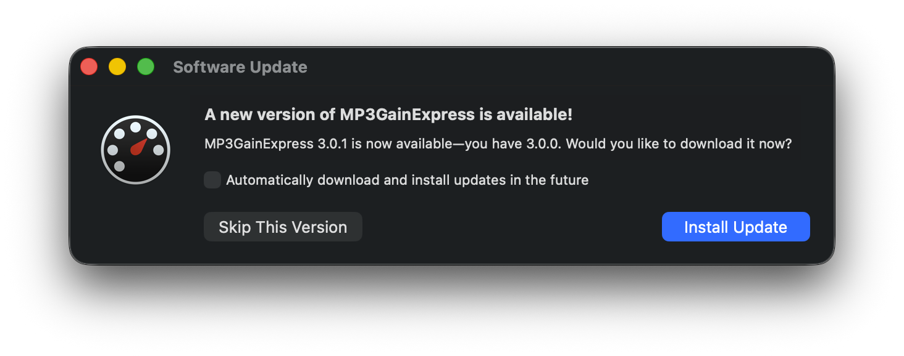
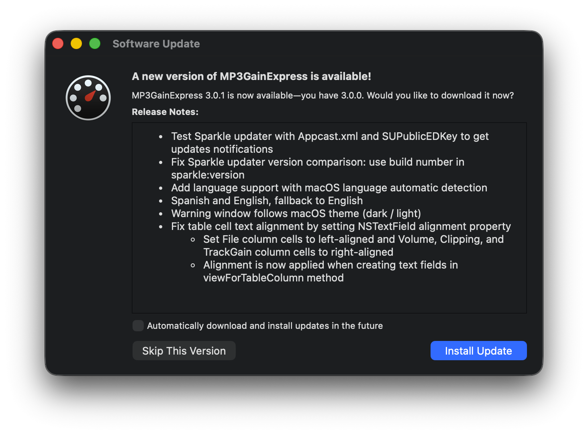

# Configuración de Actualizaciones de Sparkle

Este documento describe cómo configurar el sistema de actualización automática de Sparkle en un repositorio de GitHub que contiene un proyecto de Xcode. Se asume que el paquete de Sparkle y la lógica para buscar actualizaciones ya se han añadido al proyecto de Xcode, y que lo que queda por configurar es cómo subir una versión a GitHub para que el usuario sepa si tiene la última versión de la aplicación.

## Resumen

Existe un repositorio de ejemplo [MP3GainOSX-text](https://github.com/perez987/MP3GainOSX-text) que utiliza el framework Sparkle (versión 1.24.0) para proporcionar actualizaciones automáticas, como complemento a la información de este tutorial. El feed de actualizaciones se define en el archivo `appcast.xml`, ubicado en la raíz del repositorio.

## Generar claves

- Obtén una distribución de Sparkle desde la página [releases](https://github.com/sparkle-project/Sparkle/releases)
- Ejecuta `./generate_keys` (disponible en la carpeta `bin` en la raíz de la distribución de Sparkle; esto sólo debe hacerse una vez):
   - Genera una clave privada que se guarda en la cadena de claves de inicio de sesión del Mac.
   - Imprime una clave pública para integrarla en las aplicaciones; anota esta clave para usarla posteriormente en el archivo Info.plist de Xcode.
- Ejecuta `./generate_keys` cada vez que necesites ver la clave pública.

## Configuración

### Ajustes de Info.plist

Agregue las siguientes claves en `MP3GainOSX-text/MP3GainOSX-text-Info.plist` para configurar Sparkle:

- SUFeedURL: Apunta al archivo XML de appcast
   - Valor actual: `https://raw.githubusercontent.com/perez987/MP3GainOSX-text/main/appcast.xml`
   - Nota: Este enlace debe apuntar a `https://raw.githubusercontent.com`, no a `https://github.com`
- SUPublicEDKey: Clave pública EdDSA (anteriormente mencionada) para verificar las firmas de actualización

```xml
	<key>SUFeedURL</key>
	<string>https://raw.githubusercontent.com/perez987/MP3GainOSX-text/main/appcast.xml</string>
	<key>SUPublicEDKey</key>
	<string>TYAEerTXwSU8wHwYzot2VEzwcPNeKLNQaTVSHkXV3vI=</string>
```

### Archivo appcast.xml

El archivo `appcast.xml` sigue el formato basado en Sparkle RSS:

```xml
<?xml version="1.0" encoding="utf-8"?>
<rss version="2.0" xmlns:sparkle="http://www.andymatuschak.org/xml-namespaces/sparkle" xmlns:dc="http://purl.org/dc/elements/1.1/">
    <channel>
        <link>https://github.com/perez987/MP3GainOSX-text</link>
        <language>en</language>
        <item>
            <title>Version 3.0.1</title>
            <description><![CDATA[
                <ul>
                    <li>Test Sparkle updater with Appcast.xml and SUPublicEDKey to get updates notifications</li>
                    <li>Fix Sparkle updater version comparison: use build number in sparkle:version</li>
                    <li>Add language support with macOS language automatic detection</li>
                    <li>Spanish and English, fallback to English</li>
                    <li>Warning window follows macOS theme (dark / light)</li>
                    <li>Fix table cell text alignment by setting NSTextField alignment property</li>
                    <ul>
                        <li>Set File column cells to left-aligned and Volume, Clipping, and TrackGain column cells to right-aligned</li>
                        <li>Alignment is now applied when creating text fields in viewForTableColumn method</li>
                    </ul>
            </ul>
            ]]></description>
            <pubDate>Mon, 17 Feb 2026 19:00:00 +0000</pubDate>
            <enclosure url="https://github.com/perez987/MP3GainOSX-text/releases/download/3.0.1/MP3GainOSX-text.zip"
                       sparkle:version="252"
                       sparkle:shortVersionString="3.0.1"
                       length="4342010"
                       sparkle:edSignature="NbZxXMJ02rcv0hr3okO0R6Anuonr1QBZTtsDrPxAxAzQWBLmmY0e6W9ha5sSC3PN8R8HVaHskl811m7bHJbqCw=="
                       type="application/octet-stream" />
            <sparkle:minimumSystemVersion>11.5</sparkle:minimumSystemVersion>
        </item>
    </channel>
</rss>
```
#### Estructura del archivo appcast.xml:

- link: dirección web del repositorio
- language: idioma predefinido
- item: para configurar más de una versión
- title: puede configurar el número de versión
- description vacía: Sparkle muestra un cuadro de diálogo de actualización más pequeño, sin notas de la versión

- description con texto HTML entre etiquetas CDATA: Sparkle muestra un cuadro de diálogo de actualización más grande donde podemos ver las notas de la versión

- enclosure: datos específicos de la versión
   - URL -> enlace al archivo ZIP de la aplicación
   - sparkle:versión -> número de compilación (`CURRENT_PROJECT_VERSION` = `CFBundleVersion`)
   - sparkle:shortVersionString -> versión de la aplicación (`MARKETING_VERSION`)
   - length -> tamaño del archivo ZIP de la aplicación en bytes
   - sparkle:edSignature -> clave pública EdDSA para verificar las firmas de las actualizaciones
   - type -> "application/octet-stream"

#### Localización de appcast.xml

Se copia a la raíz del repositorio.

## Publicación de una nueva versión

Al publicar una nueva versión, sigue estos pasos:

1. **Crear la aplicación**

- Crear la aplicación en Xcode usando la configuración release.
- Guardar la aplicación.

2. **Crear un archivo ZIP**

- Comprimir el paquete `.app`: `zip -r MP3GainOSX-text.app.zip MP3GainOSX-text.zip`
- Anotar el tamaño del archivo en bytes: `ls -l MP3GainOSX-text.zip`.

3. **Firmar la actualización (requerido por seguridad)**

- Sparkle requiere firmas EdDSA para verificar la autenticidad de la actualización.
- Comprime como ZIP el producto Xcode que se va a subir como versión a GitHub (p. ej., MP3GainOSX-text.zip).
- Ejecuta `./sign_update MP3GainOSX-text.zip` (`sign_update` está disponible en la carpeta `bin` en la raíz de la distribución de Sparkle).
- Obtienes dos datos; anótalos para su uso posterior:
   - sparkle:edSignature -> una cadena codificada en base64 que se añadirá al archivo appcast.xml.
   - length -> Tamaño del archivo ZIP en bytes.

4. **Crear una versión en GitHub**

- Crear una nueva versión en GitHub con la etiqueta de versión (p. ej., `3.5.0`).
- Subir el archivo `MP3GainOSX-text.zip` como un recurso de la versión.
- Opcional: añadir notas de la versión que describan los cambios (en la página de la versión y en appcast.xml).

5. **Actualizar appcast.xml**

- Añadir un nuevo `<item>` debajo de la sección `<language>`.
- Actualizar el número de versión, la fecha y la URL de descarga.
- Actualizar el atributo `length` con el tamaño del archivo ZIP en bytes.
- Añadir la firma EdDSA dentro de la etiqueta `<enclosure>`.

6. **Confirmar y enviar**

- Comporbar el archivo `appcast.xml` actualizado.
- Enviar a la rama principal del repositorio.
- La aplicación buscará actualizaciones y encontrará la nueva versión.

### Probar con la verificación de firmas deshabilitada (sólo desarrollo)

Sólo para pruebas, puedes deshabilitar temporalmente la verificación de firmas eliminando la clave `SUPublicDSAKeyFile` de `MP3GainOSX-text-Info.plist`. Sin embargo, esto **no se recomienda** para versiones de producción, ya que permite publicar actualizaciones falsas.

Para probar actualizaciones sin la verificación de firmas EdDSA:

1. **Elimina SUPublicEDKey de Info.plist**:

- Elimina la línea `<key>SUPublicEDKey</key>` y su valor `<string>...</string>` correspondiente.
- O coméntalo para facilitar su restauración posterior.

2. **Comprobar que SUFeedURL use raw.githubusercontent.com**:

- Correcto: `https://raw.githubusercontent.com/perez987/MP3GainOSX-text/main/appcast.xml`
- Incorrecto: `https://github.com/perez987/MP3GainOSX-text/blob/main/appcast.xml`
- La URL blob devuelve HTML, no XML, lo que provoca errores.

3. **Eliminar la firma EdDSA de appcast.xml**:

- El atributo `sparkle:edSignature` en la etiqueta `<enclosure>` se puede omitir cuando la verificación de firma está deshabilitada.

4. **Probar la configuración**:

- Compilar y ejecutar la aplicación en Xcode
- Seleccionar MP3Gain Express > Buscar actualizaciones...
- La aplicación debería obtener y analizar el feed correctamente (aunque es posible que no muestre una actualización si las versiones coinciden).

**Importante**: Recuerda volver a habilitar la verificación de firmas antes de lanzar a producción. Para ello, vuelve a agregar la clave `SUPublicEDKey` e incluye la firma EdDSA en appcast.xml.

### Probar con archivo local (sólo desarrollo)

1. **Obtén la ruta completa de tu appcast.xml:**

```bash
cd /path/to/MP3GainOSX-text
pwd
# Copia la salida, p. ej., /Users/me/MP3GainOSX-text
```

2. **Edita temporalmente Info.plist:**

```xml
<key>SUFeedURL</key>
<string>file:///Users/me/MP3GainOSX-text/appcast.xml</string>
```

3. **Compila y prueba:**

- Abre MP3GainOSX-text.xcodeproj en Xcode
- Compila (⌘B)
- Ejecuta (⌘R)
- Selecciona MP3GainOSX-text > Buscar actualizaciones...

4. **Resultado esperado:**

- Verás una advertencia de seguridad (esperada con file:///) sobre "Actualización automática no configurada".
- Haz clic en Aceptar.

Deberías ver:

- "¡Estás actualizado!" (si la versión de compilación coincide con la de Appcast).
- "Hay una nueva versión disponible" (si la versión de Appcast es superior).
- "Error de actualización" con fallo de verificación de firma (si la firma no es válida).

5. **Recuerda revertir SUFeedURL** antes de confirmar.

## Notas importantes

- Se pueden listar varias versiones en el archivo de appcast (la más reciente primero).
- Sparkle determinará automáticamente si hay una actualización disponible.
- La comparación de versiones utiliza control de versiones semántico.
- Los usuarios pueden buscar actualizaciones manualmente a través del menú de la aplicación: **DownloadFullExpress > Buscar actualizaciones...**.

## Solución de problemas

### "¡Error de actualización!"

Si el usuario ve el mensaje "Error al recuperar la información de actualización", comprueba lo siguiente:

1. El archivo `appcast.xml` es accesible en la URL especificada en `SUFeedURL`.
- Error común: Usar `https://github.com/.../blob/main/appcast.xml` en lugar de `https://raw.githubusercontent.com/.../main/appcast.xml`.
- La URL blob devuelve HTML (lo que provoca errores de "atributo crossorigin"), no el contenido XML sin procesar.
- Utiliza siempre la URL `raw.githubusercontent.com` para el feed.
2. El XML está bien formado (sin errores de sintaxis).
3. La URL de descarga en la etiqueta `<enclosure>` es válida y accesible.
4. El recurso de la versión existe en GitHub.

### Errores de verificación de firma EdDSA

Si la verificación de firma falla:

1. Asegúrate de que el valor `SUPublicEDKey` en Info.plist coincida con la clave pública de su par de claves.
2. Comprueba que `sparkle:edSignature` en el appcast coincida con la firma del archivo ZIP.
3. Verifica que estas usando el nombre de atributo correcto: `sparkle:edSignature` (no `sparkle:dsaSignature`).
4. Asegúrate de que la firma se generó con la clave privada correspondiente.
5. Considera deshabilitar la verificación de firma durante las pruebas (no se recomienda para producción).

## Referencias

- [Sparkle Project](https://sparkle-project.org/)
- [Sparkle 1.x Documentation](https://sparkle-project.org/documentation/)
- [Creating an Appcast](https://sparkle-project.org/documentation/publishing/)
